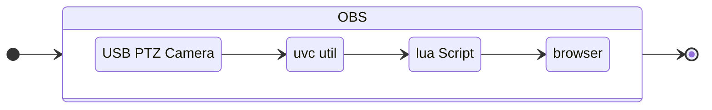

# Moving_Virtual_Background
Use the Photo Sphere Viewer Javascript library as a virtual background.  

Making a virtual background that follows the position of a USB PTZ camera.  

This version is MacOS only.  The same idea could be done in windows.  

### Repositories 

[Photo Sphere Viewer](https://photo-sphere-viewer.js.org/)

[USB Video Capture (UVC) Utility for Mac](https://github.com/jtfrey/uvc-util)

[OBS Lua Script to run UVC commands](https://github.com/marklagendijk/obs-scene-execute-command-script)

